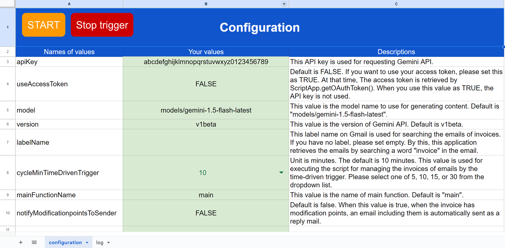
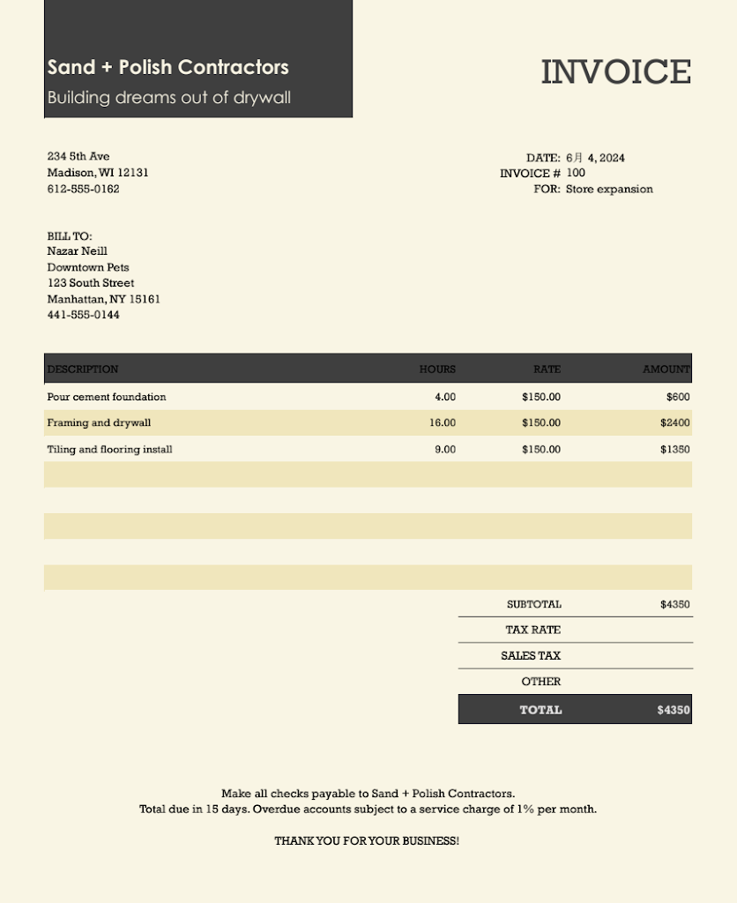
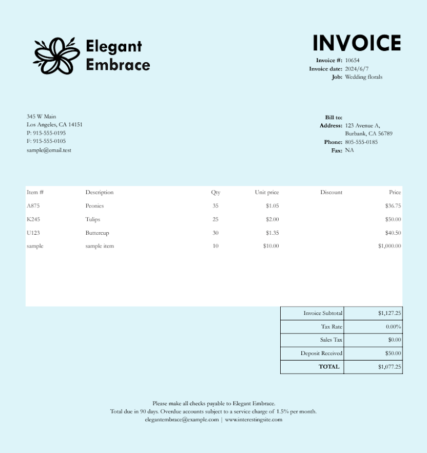
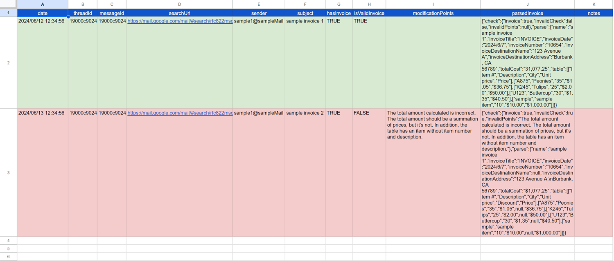

# UnlockSmartInvoiceManagementWithGeminiAPI


# Overview

This is an application for "Unlock Smart Invoice Management: Gemini, Gmail, and Google Apps Script Integration".

# Abstract

This report describes an invoice processing application built with Google Apps Script. It leverages Gemini, a large language model, to automatically parse invoices received as email attachments and automates the process using time-driven triggers.

# Introduction

The emergence of large language models (LLMs) like ChatGPT and Gemini has significantly impacted various aspects of our daily lives. One such example is their ability to automate tasks previously requiring manual effort. In my case, Gemini has streamlined the processing of invoices I receive as email attachments in PDF format.

Before Gemini, I manually reviewed each invoice, extracting crucial information. However, with Gemini's release, this tedious process transformed. As previously reported, Gemini can automatically parse invoices. [Ref](https://medium.com/google-cloud/parsing-invoices-using-gemini-1-5-api-with-google-apps-script-1f32af1678f2) Furthermore, my subsequent reports explored the ability to:

- Return parsed invoice data in JSON format [Ref](https://medium.com/google-cloud/taming-the-wild-output-effective-control-of-gemini-api-response-formats-with-response-mime-type-da273c08be85) [Ref](https://medium.com/google-cloud/taming-the-wild-output-effective-control-of-gemini-api-response-formats-with-response-schema-ae0097b97502)
- Upload files to Gemini for content generation, as demonstrated through my creation of a dedicated library [Ref](https://github.com/tanaikech/GeminiWithFiles)

These advancements allowed me to expand a simple invoice parsing script into a full-fledged application. This report details an application built using Google Apps Script. The application retrieves emails containing invoices from Gmail, utilizes the Gemini API to parse the extracted invoices, and leverages time-driven triggers for automatic execution. This approach ensures seamless processing of all invoice-related emails.

# Repository of this application

[https://github.com/tanaikech/UnlockSmartInvoiceManagementWithGeminiAPI](https://github.com/tanaikech/UnlockSmartInvoiceManagementWithGeminiAPI)

# Why Google Apps Script?

I chose Google Apps Script to create this application for several reasons:

- Ease of Use: Google Apps Script is a low-code platform, making it accessible to users with no coding experience.
- Seamless Integration: It integrates effortlessly with Gmail, Google Docs (including Docs, Sheets, Slides, and more), and various Google APIs.
- Cloud-Based Automation: As a cloud-based scripting language, Google Apps Script can be triggered to run by time-based triggers.- Personal opinion: I would like to introduce the advantages of Google Apps Script.

# Origin for constructing this application

The origin for constructing this application is as follows.

- Apr 3, 2024: [Parsing Invoices using Gemini 1.5 API with Google Apps Script](https://medium.com/google-cloud/parsing-invoices-using-gemini-1-5-api-with-google-apps-script-1f32af1678f2)
- Apr 10, 2024: [Specifying Output Types for Gemini API with Google Apps Script](https://medium.com/google-cloud/specifying-output-types-for-gemini-api-with-google-apps-script-c2f6a753c8d7)
- Apr 26, 2024: [GeminiWithFiles of a Google Apps Script library](https://github.com/tanaikech/GeminiWithFiles)
- May 1, 2024: [Taming the Wild Output: Effective Control of Gemini API Response Formats with response_mime_type](https://medium.com/google-cloud/taming-the-wild-output-effective-control-of-gemini-api-response-formats-with-response-mime-type-da273c08be85)
- May 21, 2024: [Taming the Wild Output: Effective Control of Gemini API Response Formats with response_schema](https://medium.com/google-cloud/taming-the-wild-output-effective-control-of-gemini-api-response-formats-with-response-schema-ae0097b97502)

This application was created by integrating those sources.

## Comments:

Before the `response_mime_type` property was released, I used function calls to control the output format. However, after the release of `response_mime_type`, it became the preferred method for controlling the output format. I also tested using the `response_schema` property when it was released, but found that the combination of `response_mime_type` and a JSON schema in the prompt provides the most control over the output format. As a result, this application parses invoices using the combination of `response_mime_type` and a JSON schema in the prompt.

# Usage

## 1. Copy Google Spreadsheet

Please copy a Google Spreadsheet including this application to your Google Drive. So, please access the following URL.

[https://docs.google.com/spreadsheets/d/17UjnOcz8vyrpDI6pNhms4d2ZXAy6aWTYgmTkvZcuqaA/copy](https://docs.google.com/spreadsheets/d/17UjnOcz8vyrpDI6pNhms4d2ZXAy6aWTYgmTkvZcuqaA/copy)

When you open the script editor of this Spreadsheet, you can see the following script files.

- `main.gs`: This includes the main methods.
- `InvoiceManager.gs`: This includes the main class object.
- `GeminiWithFiles.gs`: This is from [GeminiWithFiles (Author: me)](https://github.com/tanaikech/GeminiWithFiles).
- `PDFApp.gs`: This is from [PDFApp (Author: me)](https://github.com/tanaikech/PDFApp).

## 2. Create an API key

Please access [https://ai.google.dev/gemini-api/docs/api-key](https://ai.google.dev/gemini-api/docs/api-key) and create your API key. At that time, please enable Generative Language API at the API console. This API key is used for this sample script.

This official document can be also seen. [Ref](https://ai.google.dev/).

Of course, if you can link the Google Cloud Platform Project to the Google Apps Script Project in the copied Spreadsheet, you can also use the access token.

## 3. Setup

Open the "configuration" sheet and enter your API key. If you want to use the access token, leave the API key field blank and set useAccessToken to TRUE. You can also set other parameters as needed.



By default, this application checks emails in the "INBOX" label that include invoices. To search emails from specific labels, set the label containing invoices to labelName. The script will then search for emails with that label.

From v1.0.1, in order to easily customize the value of "jsonSchema" for generating content with Gemini API, I added it as a new sheet of "jsonSchema" sheet in the Spreadsheet. When you customize it, you can edit the cell "A1" of the "jsonSchema" sheet. By this, the script generates content with Gemini API using your customized JSON schema. The cell "A2" is the number of characters of "A1".

## 4. Testing

Clicking the "START" button on the "Configuration" sheet runs the application's script. However, you might see "No emails were processed" in the dialog even after running the script. In this case, to test the application, please send an email to your account that includes an invoice as a PDF attachment. Then, click the "START" button again.

The script execution triggers a time-driven trigger, which automatically runs the application based on the `cycleMinTimeDrivenTrigger` interval.

### Sample invoice 1



This sample invoice is from [here](https://create.microsoft.com/en-us/template/service-invoice-with-tax-calculations-9330a1fe-20ae-4590-ac01-54c53ed1f3ba). When this application parses this invoice, the following JSON is returned.

```
{
  "check": {
    "invoice": true,
    "invalidCheck": false,
    "invalidPoints": null
  },
  "parse": {
    "name": "invoice1.png",
    "invoiceTitle": "INVOICE",
    "invoiceDate": "6月 4, 2024",
    "invoiceNumber": "100",
    "invoiceDestinationName": "Nazar Neill",
    "invoiceDestinationAddress": "Downtown Pets\n123 South Street\nManhattan, NY 15161",
    "totalCost": "$4350",
    "table": [
      ["DESCRIPTION", "HOURS", "RATE", "AMOUNT"],
      ["Pour cement foundation", "4.00", "$150.00", "$600"],
      ["Framing and drywall", "16.00", "$150.00", "$2400"],
      ["Tiling and flooring install", "9.00", "$150.00", "$1350"]
    ]
  }
}
```

When you see this JSON, you can see that the values `invalidCheck` and `invalidPoints` are `false` and `null`, respectively. From this, it is found that this invoice has no issues.

### Sample invoice 2



This sample invoice is from [here](https://create.microsoft.com/en-us/template/simple-invoice-7c5c0318-8bc0-4ec9-8be3-2683dbf8adae). When this application parses this invoice, the following JSON is returned.

```
{
  "check": {
    "invoice": true,
    "invalidCheck": true,
    "invalidPoints": "The total amount calculated is incorrect. The total amount should be a summation of prices, but it's not. In addition, the table has an item without item number and description."
  },
  "parse": {
    "name": "invoice2.png",
    "invoiceTitle": "INVOICE",
    "invoiceDate": "2024/6/7",
    "invoiceNumber": "10654",
    "invoiceDestinationName": null,
    "invoiceDestinationAddress": "123 Avenue A,\nBurbank, CA 56789",
    "totalCost": "$1,077.25",
    "table": [
      ["Item #", "Description", "Qty", "Unit price", "Discount", "Price"],
      ["A875", "Peonies", "35", "$1.05", null, "$36.75"],
      ["K245", "Tulips", "25", "$2.00", null, "$50.00"],
      ["U123", "Buttercup", "30", "$1.35", null, "$40.50"],
      ["sample", "sample item", "10", "$10.00", null, "$1,000.00"]
    ]
  }
}
```

When you see this JSON, you can see that the values `invalidCheck` and `invalidPoints` are `true` and `The total amount calculated is incorrect. The total amount should be a summation of prices, but it's not. In addition, the table has an item without item number and description.`, respectively. From this, it is found that this invoice has issues and the modification points are suggested.

## Log

After processing the two invoices mentioned above, the application displays the following information in the "log" sheet:



- Valid invoices: These will be displayed in green.
- Invalid invoices: These will be displayed in red.

For invalid invoices, the application can automatically send an email response containing the necessary corrections. However, during my testing with various invoices, I encountered instances where the `invalidCheck` value was flagged as `true` even for invoices without errors. Due to this, I have temporarily set the `notifyModificationPointsToSender` value to `FALSE` by default. I anticipate the content generation accuracy to improve in future updates.


# Applied Section
When the method shown in this report is used, the parsing functionality can be extended to other document types besides invoices by modifying the JSON schema.


# Future update

- Currently, Gemini 1.5 API cannot directly use PDF data. As a workaround, this sample converts each page of the PDF data to PNG images. When direct PDF processing is available in a future update, I expect the accuracy for generating content to improve.

# Note

- The top abstract image was created by [Gemini](https://gemini.google.com/app).

---

<a name="licence"></a>

# Licence

[MIT](LICENCE)

<a name="author"></a>

# Author

[Tanaike](https://tanaikech.github.io/about/)

[Donate](https://tanaikech.github.io/donate/)

<a name="updatehistory"></a>

# Update History

- v1.0.0 (June 15, 2024)

  1. Initial release.

- v1.0.1 (June 17, 2024)

  1. In order to easily customize the value of "jsonSchema" for generating content with Gemini API, I added it as a new sheet of "jsonSchema" sheet in the Spreadsheet. When you customize it, you can edit the cell "A1" of the "jsonSchema" sheet. By this, the script generates content with Gemini API using your customized JSON schema. The cell "A2" is the number of characters of "A1".

[TOP](#top)
